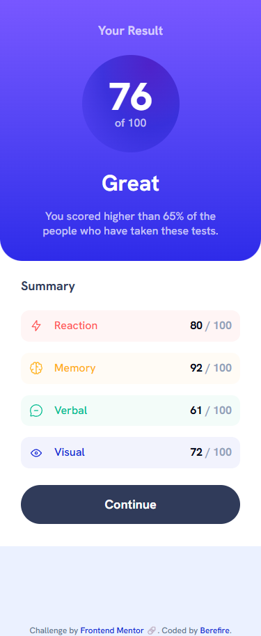
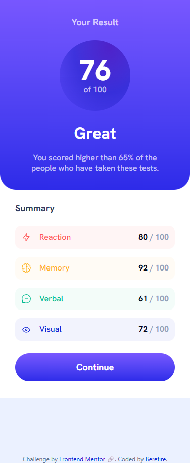
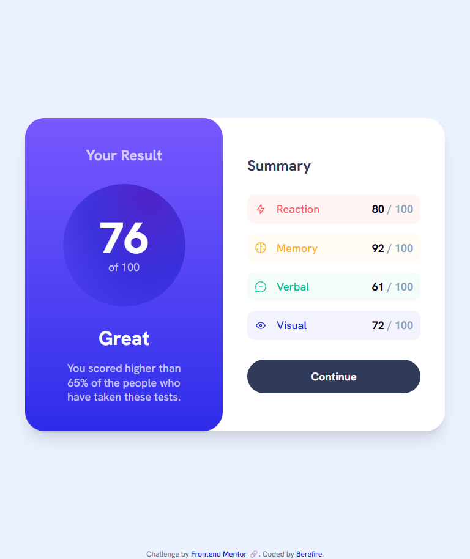
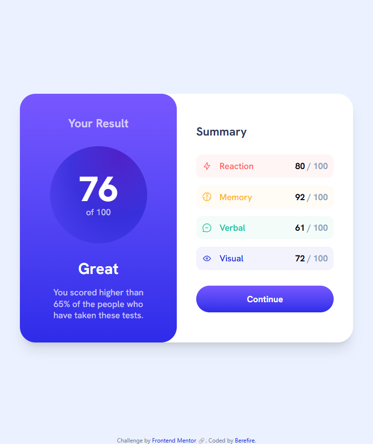
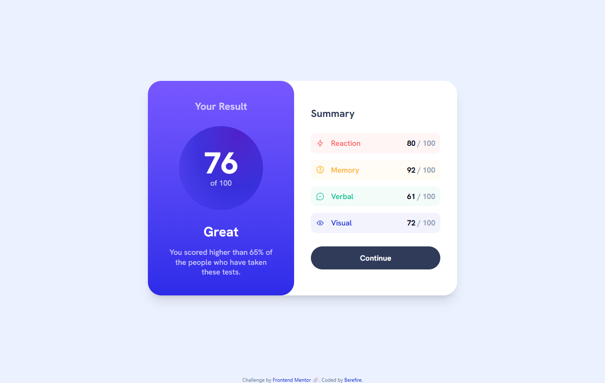
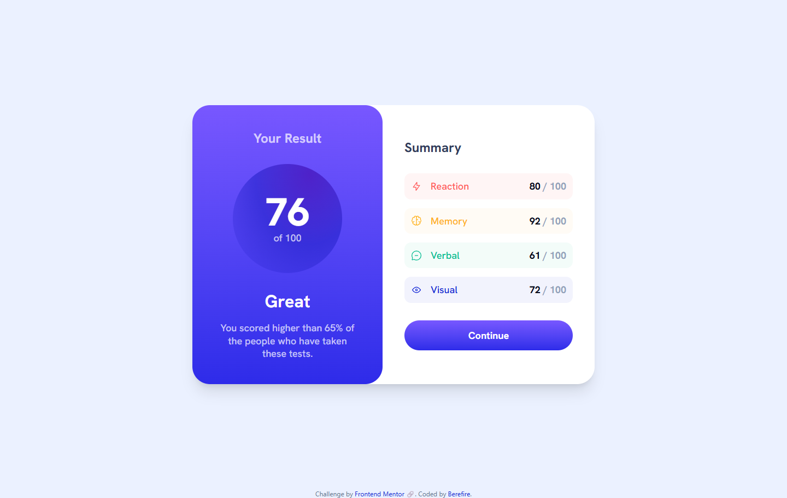

# Frontend Mentor - Results summary component solution


[](https://www.frontendmentor.io/)


[](./assets/downloads/lighthouse-performance-report.pdf)

This is a solution to the [Results summary component challenge on Frontend Mentor](https://www.frontendmentor.io/challenges/results-summary-component-CE_K6s0maV). Frontend Mentor challenges help you improve your coding skills by building realistic projects.

---

## Table of contents

- [Overview](#overview)
  - [The challenge](#the-challenge)
  - [Screenshot](#screenshot)
  - [Links](#links)
- [My process](#️my-process)
  - [Built with](#built-with)
  - [What I learned](#what-i-learned)
  - [Continued development](#continued-development)
  - [Useful resources](#useful-resources)
  - [AI Collaboration](#ai-collaboration)
- [Author](#author)
- [Acknowledgments](#acknowledgments)

---

## 📖Overview

### The challenge

Users should be able to:

- View the optimal layout for the interface depending on their device's screen size
- See hover and focus states for all interactive elements on the page
- **Bonus**: Use the local JSON data to dynamically populate the content

---

### 📸Screenshot

#### Mobile (375x914)

| _Main_ | _Active_ |
| ------ | ------ |
|  |  |

#### Tablet (768x914)

| _Main_ | _Active_ |
| ------ | ------ |
|  |  |

#### Desktop (1440x914)

| _Main_ | _Active_ |
| ------ | ------ |
|  |  |

---

### 🔗Links

- Solution URL: [https://www.frontendmentor.io/solutions/results-summary-component---react-tailwind-css-v4-and-storybook-OsWeTkwHNE](https://www.frontendmentor.io/solutions/results-summary-component---react-tailwind-css-v4-and-storybook-OsWeTkwHNE)
- Live Site URL: [https://berefire.github.io/results-summary-component/](https://berefire.github.io/results-summary-component/)

---

## ⚙️My process

### Built with

- Semantic HTML5 markup
- [React](https://react.dev/) - JS library for building the UI as small, composable components
- [Vite](https://vitejs.dev/) - build tool and dev server
- [Tailwind CSS v4](https://tailwindcss.com/) - utility-first styling via the `@tailwindcss/vite` plugin, using `@theme` for design tokens (colors, fonts) and `@utility` for custom reusable utilities like the focus ring
- [Storybook](https://storybook.js.org/) - for developing and documenting components in isolation, with Controls, accessibility checks (`addon-a11y`), and Autodocs
- CSS Grid and Flexbox, including a sticky-footer layout pattern
- Mobile-first responsive workflow
- Conventional Commits for commit message structure
- JSDoc comments on each component, picked up by Storybook Autodocs to auto-generate props tables and descriptions

---

### 💡What I learned

**Deriving state instead of duplicating it.** The overall score isn't stored anywhere — it's calculated from the `categories` array every time `ResultsSummary` renders. This avoids the two values ever getting out of sync:

```jsx
const score = categories.length
  ? Math.round(categories.reduce((total, item) => total + item.score, 0) / categories.length)
  : 0;
```

**Tailwind can't see dynamically-built class names.** Tailwind's compiler only generates CSS for class names it finds as literal text while scanning the source. Building a class name at runtime (e.g. `` `bg-${color}-50` ``) means Tailwind never sees the real string and silently generates nothing. The fix is a lookup table of complete, literal class strings:

```js
export const categoryStyles = {
  Reaction: { bg: 'bg-red-50', text: 'text-red-400' },
  Memory: { bg: 'bg-yellow-50', text: 'text-yellow-400' },
  Verbal: { bg: 'bg-green-50', text: 'text-green-500' },
  Visual: { bg: 'bg-blue-50', text: 'text-blue-800' },
};
```

**CSS specificity can quietly override your own utility classes.** The focus ring utility originally redeclared `border-radius` inside its own `:focus-visible` block. Because a pseudo-class combined with a class beats a single class in specificity, that declaration silently overrode `rounded-full` on the Button every time it was focused. Removing the redundant `border-radius` fixed it — and it turns out modern browsers already curve an outline to match an element's existing border-radius automatically, so the declaration was never needed in the first place:

```css
@utility focus-ring {
  &:focus-visible {
    outline: 0.14em solid var(--focus-ring-color, currentColor);
    outline-offset: 0.125em;
  }
}
```

**`base` path deployment doesn't treat all asset references the same way.** With a GitHub Pages `base` path configured in `vite.config.js`, CSS `url()` references to files in `public/` get rewritten automatically at build time — but a raw path string sitting in a JS/JSON data file does not. Icon paths referenced from `data.json` needed an explicit prefix:

```jsx

```

**Storybook config keys have to live in the right place.** Autodocs stayed broken for a while because `tags: ['autodocs']` was nested inside the `parameters` object in `.storybook/preview.js` instead of being a top-level sibling of it — a config file can look correct and still silently do nothing if a key is one level too deep.

---

### 🚀Continued development

- Wire up the "Continue" button to a real destination — it's still a placeholder `href="#"`
- Learn TypeScript to get real prop type-checking instead of relying on JSDoc comments alone
- Write actual Storybook interaction/accessibility tests using the `addon-vitest` integration that's already configured but unused so far
- Get more comfortable with more advanced React state patterns beyond `useState` (context, reducers) on a project that needs them
- Run a proper automated contrast check (not just a visual one) on the white/70% text over the score gradient

---

### 📚Useful resources

- [Tailwind CSS v4 - Theme variables](https://tailwindcss.com/docs/theme) - Explains the `@theme` directive and how design tokens automatically generate matching utility classes.
- [Tailwind CSS - Adding custom utilities](https://tailwindcss.com/docs/adding-custom-styles#adding-custom-utilities) - Reference for the `@utility` directive used to build the reusable `focus-ring` utility.
- [Storybook - Autodocs](https://storybook.js.org/docs/writing-docs/autodocs) - Clarified exactly where `tags: ['autodocs']` needs to live for docs pages to generate at all.
- [MDN - `:focus-visible`](https://developer.mozilla.org/en-US/docs/Web/CSS/:focus-visible) - Helped explain why keyboard-only focus styling behaves differently from `:focus`, and why outlines follow border-radius automatically.
- [Vite - Building for production (base path)](https://vitejs.dev/guide/build.html#public-base-path) - Clarified which asset references do and don't get automatically rewritten under a non-root `base` path.

---

### 🤖AI Collaboration

I used Claude throughout this project, in two phases. It started as a guided tutor for React and Storybook fundamentals (short explanations plus small exercises before writing real code), then shifted into ongoing pair-programming support once I started building this challenge for real — debugging Tailwind v4/Vite/Storybook configuration issues, reviewing accessibility choices, matching gradient colors exactly against the Figma design file, fixing layout bugs, adding JSDoc documentation for Storybook's Autodocs, and reviewing my git commit messages against the Conventional Commits standard.

- **What worked well:** giving it my actual error messages and pasted code got much more useful answers than describing the problem in words, and having it verify version-specific tooling behavior (Tailwind v4 syntax, Vite's base-path asset handling, Storybook's docs config) against official documentation rather than guessing from memory avoided a few wrong turns.

- **What didn't work as well at first:** a color-matching bug (the score circle looking too pale/"sunken") went through several wrong guesses based on screenshots alone before we solved it properly — the real fix only came once I pulled the exact HSL values from the Figma file's gradient inspector instead of letting the AI guess from an image. Good reminder that AI suggestions are only as good as the source data behind them.

---

## 👤Author

- Frontend Mentor - [@berefire](https://www.frontendmentor.io/profile/berefire)
- GitHub - [@berefire](https://github.com/berefire)

---

## 🙏Acknowledgments

Thanks to Frontend Mentor for the challenge design files and starter assets, and to Claude for the guided lessons and hands-on debugging help throughout the build.

---
